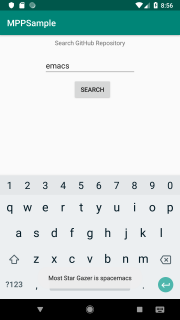
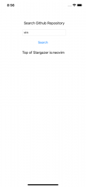

# MPPSample
This repository is a kotlin multiplatform project(MPP) sample based on [AAkira/mpp-example](https://github.com/AAkira/mpp-example).

## Implemetion
This repository implemented Android and iOS.
Search github repository using github api and show top of stargazer.

### Common
- Api Client
- Data Class

### Expect, Actual
- Handling Device Strage(SharedPreferences, UserDefaults)
- CoroutineDispatcher

## Screeenshot
### Android

### iOS

